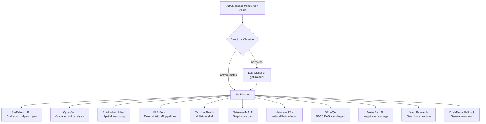

# AgentWhetters Dispatch General Purple

## Abstract

This agent combines specialized skills developed and hardened across multiple competition sprints into a single dispatch-based architecture. Rather than attempting true generalization from first principles, we take the pragmatic approach of leveraging domain-specific agents we have honed over Sprints 1-4 and routing incoming tasks to the appropriate specialist. A lightweight classifier identifies the task type using cheap model inference, then dispatches to the skill module best equipped to solve it. We acknowledge this is not genuine generalization -- it is an ensemble of narrow experts behind a routing layer. The competitive advantage comes from the depth of each specialist rather than breadth of a single model.

We also developed a second general-purpose purple agent (ADK-based) that takes a more conventional single-model approach without specialized dispatch. This serves as both a comparison point and a fallback for task categories we have not explicitly optimized.

## Design

The agent operates on a two-tier classification strategy:

1. **Structural pre-filter** -- Fast regex and substring matching routes ~80% of tasks without any LLM call. Each green agent produces characteristic message patterns (JSON schemas, protocol markers, file attachments) that can be detected deterministically.

2. **LLM fallback classifier** -- For the remaining ~20%, a cheap model (gpt-4o-mini) classifies into one of the known task types. This adds latency but avoids misrouting ambiguous inputs.

3. **Strong model execution** -- Once classified, complex tasks (SWE-bench, CyberGym, MLE-Bench) are routed to gpt-5.4 while simpler tasks stay on the cheap model.

Each skill module encapsulates the full solution strategy for its domain, developed and tested in isolation during prior sprints before integration into this dispatch agent.

## Architecture



## Skills

Each skill was developed as a standalone agent in prior sprints, then integrated:

| Skill | Sprint | Approach |
|-------|--------|----------|
| SWE-bench Pro | Sprint 2 | Docker exec with multi-step LLM patch generation and test validation |
| CyberGym | Sprint 3 | Containerized vulnerability analysis with PoC exploit generation |
| Build What I Mean | Sprint 1 | Spatial reasoning with coordinate generation and plan verification |
| MLE-Bench | Sprint 4 | Zero-LLM Phase 0 (LGBM+CatBoost ensemble), NB-SVM text, CNN image, LLM fallback |
| Terminal Bench | Sprint 3 | Protocol adapter for multi-turn containerized shell interaction |
| NetArena MALT | Sprint 3 | Capacity graph analysis with Python code generation |
| NetArena K8s | Sprint 3 | Kubernetes NetworkPolicy debugging via structured analysis |
| OfficeQA | Sprint 2 | BM25 over Treasury Bulletins with LLM code-gen for table extraction |
| MAizeBargAIn | Sprint 4 | Multi-turn negotiation with BATNA-aware concession strategy |
| Web Research | Sprint 4 | Information retrieval via web search and content extraction |

## Honest Assessment

This agent is not general in any meaningful sense. It cannot solve novel task categories it has not been explicitly programmed for. Its "generality" comes from covering enough categories (10+ specialized skills) that it appears general across the competition's benchmark set. The dual-model fallback provides a safety net for unrecognized tasks, but performance on truly novel problems will be mediocre compared to the specialized paths.

The value of this architecture is:
- Each skill was iteratively improved over multiple sprints with real benchmark feedback
- The routing layer adds negligible latency (structural matching is instant, LLM fallback is one cheap call)
- Skills are isolated -- a bug in one module cannot crash another
- New skills can be added without touching existing ones

## Running

```bash
uv sync --locked
uv run src/server.py
```

Listens on port 9009. Agent card at `/.well-known/agent.json`.

## Environment

- `AZURE_OPENAI_ENDPOINT` -- Azure OpenAI endpoint
- `AZURE_OPENAI_API_KEY` -- API key
- `AZURE_OPENAI_DEPLOYMENT` -- Strong model (default: gpt-5.4)
- `AGENT_CHEAP_MODEL` -- Classification model (default: gpt-4o-mini)
- `PORT` -- Server port (default: 9009)
